# Delta App

Delta App is a simple Express.js application integrated with a MySQL database, allowing users to view and manage user data.

## Table of Contents
1. [Installation](#installation)
2. [Usage](#usage)
3. [Routes](#routes)
4. [Database Setup](#database-setup)
5. [Technologies Used](#technologies-used)
6. [Contributing](#contributing)


## Installation

To install Delta App locally, follow these steps:

1. **Clone the repository:**
   ```bash
   git clone <repository-url>
   ```

2. **Install dependencies:**
   ```bash
   npm install
   ```

3. **Set up the database (see [Database Setup](#database-setup)).**

4. **Start the server:**
   ```bash
   npm start
   ```

## Usage

Once the server is running, you can access the following routes:

## Routes

- **Home**: View the total count of users.
  ```
  GET /
  ```

- **Show Users**: View all users stored in the database.
  ```
  GET /user
  ```

- **Edit User**: Edit the details of a specific user.
  ```
  GET /user/:id/edit
  ```

## Database Setup

1. **Ensure you have MySQL installed on your system.**

2. **Create a MySQL database named `delta_app`.**

3. **Run the SQL schema file to set up the database schema:**
   ```bash
   mysql -u <username> -p delta_app < db/schema.sql
   ```

4. **Optionally, you can seed the database with sample data:**
   ```bash
   mysql -u <username> -p delta_app < db/seed.sql
   ```

## Technologies Used

- **Express.js**: Express.js is a minimalist web framework for Node.js that simplifies the process of building web applications and APIs.
  
- **Method-Override**: The `method-override` middleware is used to support HTTP verbs such as PUT and DELETE in places where the client doesn't support it.

- **EJS (Embedded JavaScript)**: EJS is a simple templating language that lets you generate HTML markup with plain JavaScript.

- **MySQL**: MySQL is a popular open-source relational database management system used to store and manage user data in Delta App.

- **Faker.js**: Faker.js is a library for generating fake data such as names, addresses, and email addresses, used in development and testing environments.

## Contributing

Contributions are welcome! If you find any bugs or have suggestions for improvement, please open an issue or submit a pull request.

## Demonstartion


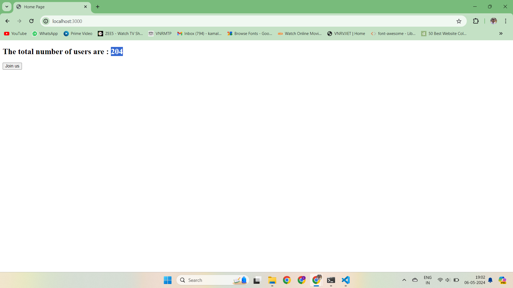


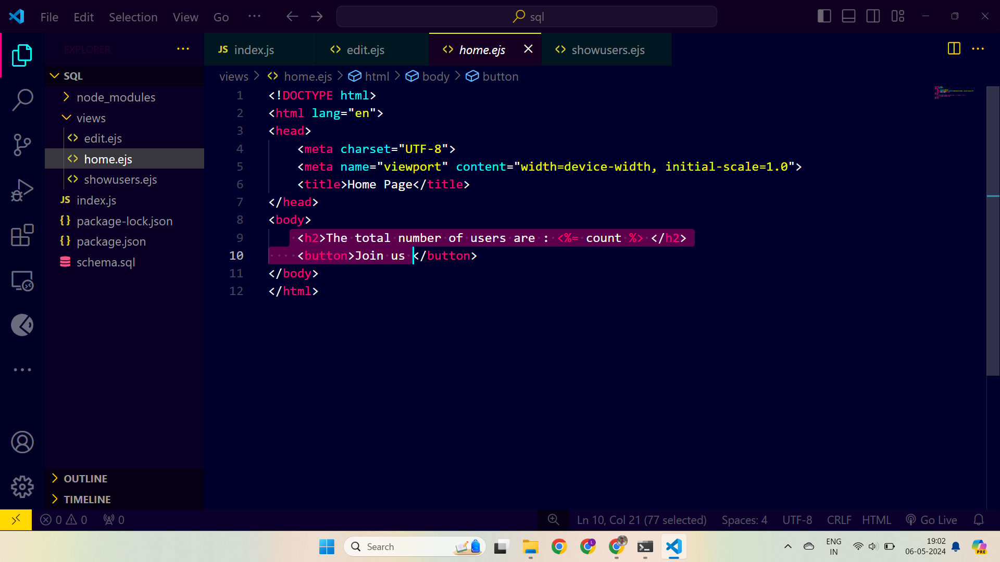


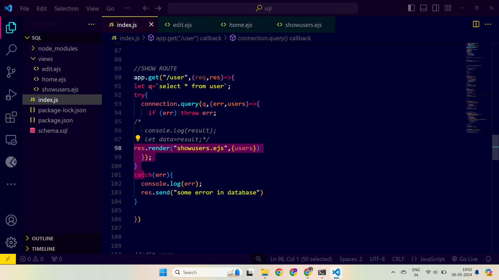


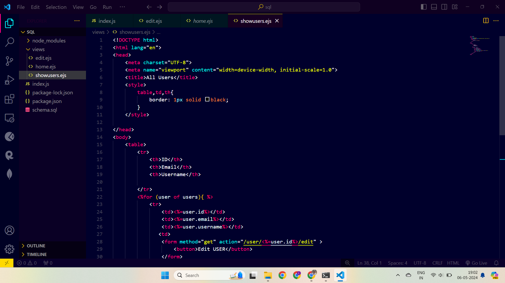


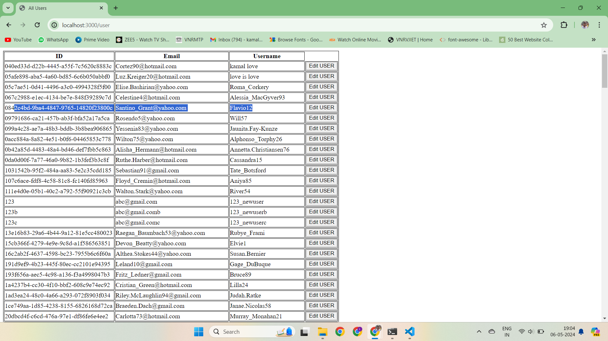


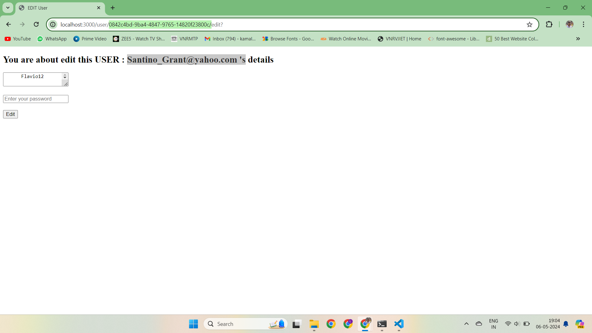


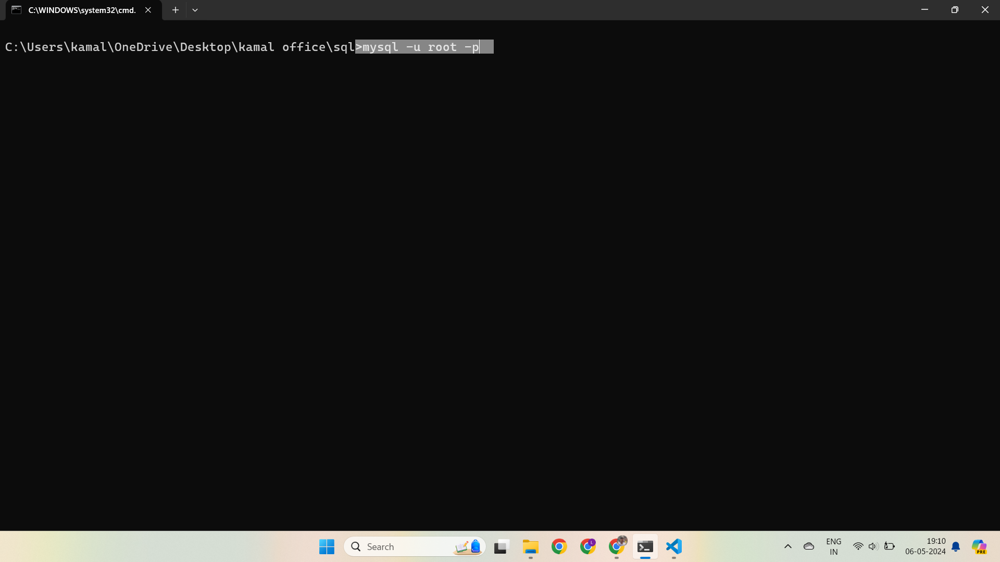


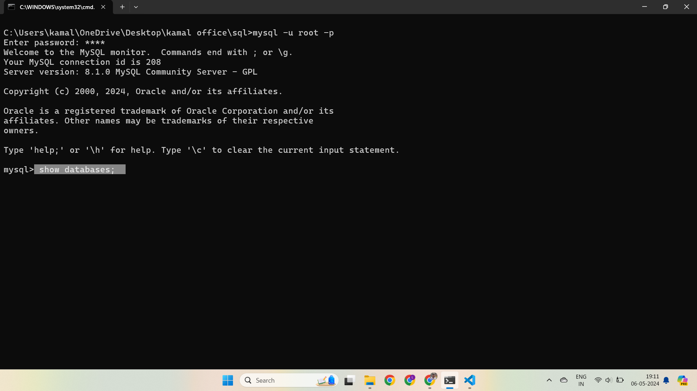


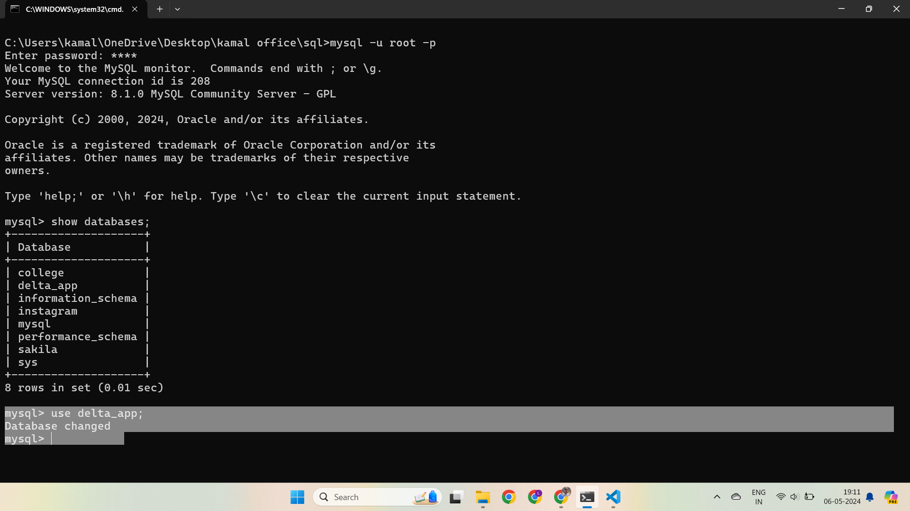


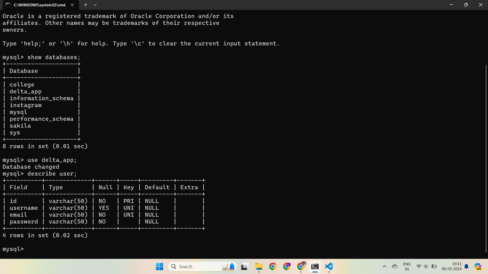


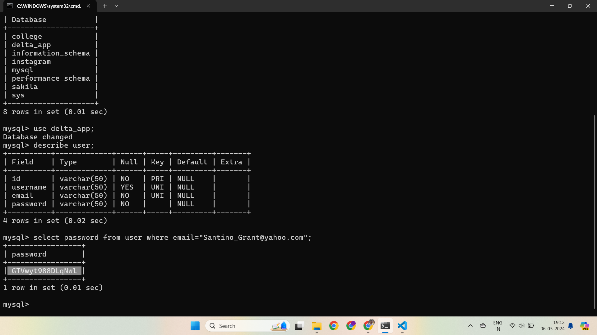


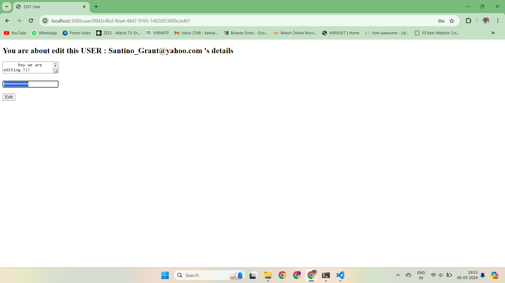


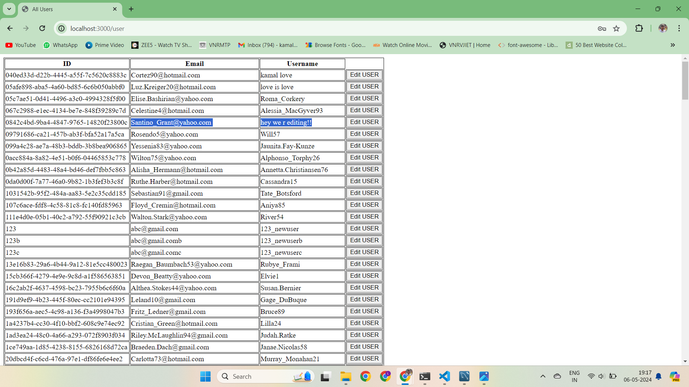

